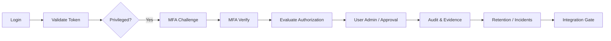

# Authentication Module API — Business Documentation

This document explains every public API operation of the **Authentication Module Service Host** from a business perspective. It is intended for business analysts, compliance officers, security reviewers, and end-user documentation authors who need to understand what each endpoint does, where it fits in the process, and what data it consumes and produces.

The Service Host is an ASP.NET Core minimal-API service. The service is grouped into four functional areas:

- **Service Metadata** — runtime status and interactive API documentation.
- **Foundation Diagnostics** — health and store integrity checks.
- **Core Security** — authentication, token validation, authorization, MFA, user administration, and governance approvals.
- **Governance** — audit, evidence, data-subject requests, retention, incidents, and backup evidence.
- **Integration** — integration readiness gate that validates contract conformance and requirement traceability.

## Conventions

### Base URL

All routes in this document are relative to the Service Host base URL, for example:

```text
https://<host>/api/core-security/auth/login
```

### Request headers

Most endpoints build an internal **Request Context** from the following HTTP headers and connection data. These headers are optional in the current implementation but should be supplied by any production caller (for example an API gateway) so that audit events contain a clear actor and session.

| Header / Source | Format | Business meaning |
|---|---|---|
| `X-Actor-UserId` | GUID | Identifier of the human or service account performing the action. Used for authorization decisions and audit events. |
| `X-Session-Id` | GUID | Identifier of the caller's authenticated session. Used to correlate audit events with the session that produced them. |
| `SourceIp` | IP address | Taken from the remote connection. Records the network origin of the request in audit events. |
| `CorrelationId` | GUID | Generated automatically for every request. Ties together all audit, evidence, and incident records produced during the request. |

### Date/time values

All `DateTimeOffset` fields are serialized as ISO 8601 strings with offset, for example `2026-01-15T09:30:00+00:00`.

### Enumerations

Enumeration values are serialized as JSON strings (for example `"Active"`, not `1`). The tables below list the permitted values for each enum.

### Success and error responses

On success, endpoints return a `200 OK` response with the response body described in each section. The token validation endpoint returns claims, the MFA verify endpoint returns `204 NoContent`, and the health endpoint returns a small JSON object.

On failure, the service returns a **Problem Details** JSON object:

```json
{
  "type": "urn:auth-module:error:ValidationFailed",
  "title": "ValidationFailed",
  "status": 400,
  "detail": "Human-readable description of the failure.",
  "errorCode": "VALIDATIONFAILED",
  "correlationId": "<guid>"
}
```

| `errorCode` | HTTP status | Typical business meaning |
|---|---|---|
| `VALIDATIONFAILED` | 400 | A required field is missing or malformed. |
| `UNAUTHORIZED` | 401 | The caller's credentials or token are missing, invalid, or expired. |
| `FORBIDDEN` | 403 | The caller is authenticated but not allowed to perform this action. |
| `NOTFOUND` | 404 | A referenced entity (user, ticket, incident, etc.) does not exist. |
| `CONFLICT` | 409 | The requested state change conflicts with the current state (for example a duplicate user or an already-decided ticket). |
| `POLICYVIOLATION` | 422 | A business rule or policy is violated (for example SoD approval required, legal hold blocks deletion). |
| `INTERNAL` | 500 | An unexpected service error occurred. |

> Note: the governance and integration modules map `POLICYVIOLATION` to 422 as well; the core security module currently maps `PolicyViolation` to 500 in its problem-details helper.

---

## High-level process flow

The API is used in three broad business processes:

1. **Authenticate and act** — login, validate the token, evaluate permissions, optionally step-up with MFA, then perform a privileged or administrative action.
2. **Govern and evidence** — capture evidence, query the audit trail, handle data-subject requests, run retention, and manage incidents and backup records.
3. **Validate readiness** — run the integration gate to prove that the implementation still satisfies its contracts and traced user stories.



---

# Service Metadata

These endpoints help operators and documentation consumers understand and browse the API. They do not perform business logic.

## 1. `GET /`

**Business purpose:** returns the running service name, its runtime status, and the active policy configuration file path. Useful for health dashboards and verifying that the expected configuration is loaded.

**Process context:**
- **Before:** the service has started and loaded a policy configuration file.
- **After:** the caller knows whether the service is running and which configuration file is active.

**Request:** none.

**Response fields:**

| Field | Type | Description |
|---|---|---|
| `service` | string | Always `"auth-module"`. Identifies the service. |
| `status` | string | Runtime status, for example `"Running"`. |
| `configuration` | string | Absolute path of the policy configuration file currently loaded. |

## 2. `GET /docs` and `GET /docs/index.html`

**Business purpose:** serves an interactive Swagger UI page for exploring the OpenAPI contract. This is the primary technical reference for field-level schema details.

**Process context:**
- **Before:** the service is running.
- **After:** the caller's browser displays the API explorer.

**Request:** none.

**Response:** HTML page with Swagger UI.

---

# Foundation Diagnostics

These endpoints provide operational health signals and verify the integrity of the JSON-based persistence stores.

## 3. `GET /internal/foundation/health`

**Business purpose:** lightweight liveness check. Returns a status message and the current UTC timestamp.

**Process context:**
- **Before:** the service process is running.
- **After:** the caller knows the service can respond to HTTP requests.

**Request:** none.

**Response fields:**

| Field | Type | Description |
|---|---|---|
| `status` | string | Always `"Healthy"` when the endpoint responds. |
| `timestamp` | DateTimeOffset | Current UTC timestamp of the service. |

## 4. `GET /internal/foundation/integrity`

**Business purpose:** verifies the integrity of every configured JSON store (for example signature/hash verification). This is a compliance-relevant diagnostic: it proves that persisted records have not been tampered with outside the service.

**Process context:**
- **Before:** the service has loaded store files and optional integrity keys.
- **After:** the caller receives a per-store pass/fail result and an overall verdict.

**Request:** none.

**Response fields:**

| Field | Type | Description |
|---|---|---|
| `allPassed` | boolean | `true` only when every checked store passed integrity verification. |
| `fileResults` | object | Dictionary whose keys are relative store file paths and whose values are `"Pass"` or `"Fail"`. |

---

# Core Security

All routes are grouped under `/api/core-security`.

## 5. `POST /api/core-security/auth/login`

**Business purpose:** authenticates a user with email and password. On success it creates a session and issues a time-limited access token. This is the entry point for every authenticated business process.

**Process context:**
- **Before:** the user account exists in the user store and a credential record holds the current password hash.
- **After:** a session is recorded, a security audit event of type `LoginSuccess` and `TokenIssued` is written, and the caller receives an access token. If the credentials are wrong, a `LoginFailure` event is written and the failed-attempt counter may advance toward lockout.

**Authorization:** no access token is required; the caller proves identity with the password. The `X-Actor-UserId` and `X-Session-Id` headers may be empty for the initial login.

**Request fields:**

| Field | Type | Required | Description |
|---|---|---|---|
| `email` | string | yes | Email address of the user. Used as the login identifier. |
| `password` | string | yes | The user's password. Must match the stored credential hash. |
| `isPrivilegedSession` | boolean | no, default `false` | When `true`, requests an elevated session. A privileged session may require additional controls such as MFA step-up before downstream actions are permitted. |

**Response fields:**

| Field | Type | Description |
|---|---|---|
| `accessToken` | string | Time-limited bearer token (JWT) that the caller must present to authenticated endpoints. |
| `expiresAt` | DateTimeOffset | UTC timestamp when the access token expires. |
| `sessionId` | GUID | Identifier of the newly created session. Can be used for session-specific audit correlation. |

**Error scenarios:**
- Invalid or missing fields → `400 ValidationFailed`.
- Unknown email or wrong password → `401 Unauthorized`. Repeated failures may trigger account lockout, which is recorded as `AccountLocked` in the audit log.
- Disabled or locked account → `403 Forbidden`.

## 6. `POST /api/core-security/auth/validate`

**Business purpose:** checks whether an access token is still valid and returns the claims it contains. This is used whenever a service or UI needs to confirm that a token has not expired, been revoked, or violated policy constraints before trusting it.

**Process context:**
- **Before:** the caller has received an access token from login or another issuer.
- **After:** the service confirms the token signature, lifetime, issuer, audience, and session state, and writes a `TokenValidated` or `TokenRejected` audit event.

**Authorization:** none at the transport layer; the token to validate is supplied in the request body.

**Request fields:**

| Field | Type | Required | Description |
|---|---|---|---|
| `accessToken` | string | yes | The bearer token (JWT) to validate. |

**Response fields:**

| Field | Type | Description |
|---|---|---|
| `subjectUserId` | GUID | Identifier of the user the token was issued for. |
| `sessionId` | GUID | Identifier of the session the token belongs to. |
| `tokenVersion` | integer | Version of the token. Can be used to detect tokens issued before a password change or global revocation. |
| `issuer` | string | Token issuer (`iss`) claim. |
| `audience` | string | Token audience (`aud`) claim. |
| `issuedAt` | DateTimeOffset | UTC timestamp when the token was issued. |
| `expiresAt` | DateTimeOffset | UTC timestamp when the token expires. |
| `permissionKeys` | array of strings | Permissions granted to the user at the time the token was issued. |
| `isPrivileged` | boolean | `true` if the session was requested as privileged. |

**Error scenarios:**
- Malformed token, invalid signature, expired lifetime, or revoked session → `401 Unauthorized`.

## 7. `POST /api/core-security/authz/evaluate`

**Business purpose:** decides whether the requesting identity is allowed to perform a specific action on a specific resource. It enforces the authorization policy (roles, permissions, time-bound assignments) that protects sensitive operations.

**Process context:**
- **Before:** the caller has a valid token and knows the user, resource, and action it wants to evaluate.
- **After:** the service evaluates the active role/permission assignments and returns an allow/deny decision. A `PrivilegedAccess` audit event may be written.

**Authorization:** the request is evaluated for the user identified by `userId`; the calling actor should be supplied via `X-Actor-UserId`.

**Request fields:**

| Field | Type | Required | Description |
|---|---|---|---|
| `userId` | GUID | yes | User whose permissions should be evaluated. |
| `resource` | string | yes | Resource identifier or type being accessed, for example `"user-accounts"`. |
| `action` | string | yes | Action the user wants to perform, for example `"create"`, `"update"`, `"disable"`. |

**Response fields:**

| Field | Type | Description |
|---|---|---|
| `allowed` | boolean | `true` if the user is authorized to perform the action on the resource. |
| `reasonCode` | string | Machine-readable reason for the decision, for example `"permission-granted"` or `"no-matching-permission"`. |
| `permissionEvaluated` | string | The permission key that was evaluated to reach the decision. |

**Error scenarios:**
- Unknown user → `404 NotFound`.
- Caller not allowed to query this user's permissions → `403 Forbidden`.

## 8. `POST /api/core-security/mfa/challenges`

**Business purpose:** starts a multi-factor authentication (MFA) step-up challenge. Step-up is required for high-risk or privileged operations (for example approving a sensitive role change) to add a second proof of identity beyond the password.

**Process context:**
- **Before:** the user has an active session and is about to perform an operation that requires elevated assurance.
- **After:** a challenge record is created with status `Pending`. The caller must deliver the challenge proof to the user out-of-band and then call `/mfa/verify`.

**Authorization:** the caller must identify the actor and session via the request headers; the target user and session are in the body.

**Request fields:**

| Field | Type | Required | Description |
|---|---|---|---|
| `userId` | GUID | yes | User who must satisfy the challenge. |
| `sessionId` | GUID | yes | Session that is requesting the step-up. |
| `operationKey` | string | yes | Business identifier of the operation being protected, for example `"approve-role-change"`. |

**Response fields:**

| Field | Type | Description |
|---|---|---|
| `challengeId` | GUID | Identifier of the created challenge. Required for verification. |
| `userId` | GUID | User who must respond to the challenge. |
| `sessionId` | GUID | Session the challenge belongs to. |
| `operationKey` | string | Operation the challenge protects. |
| `issuedAt` | DateTimeOffset | UTC timestamp when the challenge was created. |
| `expiresAt` | DateTimeOffset | UTC timestamp when the challenge expires if not verified. |
| `status` | string | Initial value is `"Pending"`. |

## 9. `POST /api/core-security/mfa/verify`

**Business purpose:** validates the proof submitted for an MFA step-up challenge. If the proof is correct, the challenge is marked as `Satisfied` and the protected privileged operation may proceed.

**Process context:**
- **Before:** a challenge has been created with `/mfa/challenges` and the user has received the verification proof.
- **After:** the challenge status is updated to `Satisfied` (success) or `Failed` (incorrect proof), and the result is recorded in the audit trail.

**Request fields:**

| Field | Type | Required | Description |
|---|---|---|---|
| `challengeId` | GUID | yes | Identifier of the challenge to verify. |
| `verificationCode` | string | yes | The proof supplied by the user, for example a TOTP code or signed response. |

**Response:** `204 NoContent` on success. No response body.

**Error scenarios:**
- Unknown challenge → `404 NotFound`.
- Wrong proof → `401 Unauthorized` (or `422 PolicyViolation` depending on policy).
- Expired challenge → `409 Conflict`.

## 10. `POST /api/core-security/governance/approvals`

**Business purpose:** creates a governance approval ticket for a sensitive role or permission change. This supports Segregation of Duties (SoD): a change that could grant excessive privilege must be reviewed and approved by a separate person before it is applied.

**Process context:**
- **Before:** a user (or automated process) wants to assign or change a role/permission combination that is flagged as sensitive.
- **After:** a ticket is created with status `Pending`. The designated approver is notified and can call `/governance/approvals/decide`. Until the ticket is approved, the change must not be applied downstream.

**Authorization:** the requesting actor must have permission to raise approval requests.

**Request fields:**

| Field | Type | Required | Description |
|---|---|---|---|
| `roleId` | GUID | yes | Role involved in the change. |
| `permissionId` | GUID | yes | Permission involved in the change. |
| `changeType` | string | yes | Business description of the change, for example `"AddPermissionToRole"`. |

**Response fields:**

| Field | Type | Description |
|---|---|---|
| `ticketId` | GUID | Identifier of the created approval ticket. |
| `changeType` | string | Type of change being requested. |
| `roleId` | GUID | Role referenced in the request. |
| `permissionId` | GUID | Permission referenced in the request. |
| `requestedByUserId` | GUID | Actor who raised the request (from `X-Actor-UserId`). |
| `requestedAt` | DateTimeOffset | UTC timestamp when the ticket was created. |
| `status` | string | `"Pending"` initially. Allowed values: `Pending`, `Approved`, `Rejected`, `Applied`. |
| `approvedByUserId` | GUID? | Populated when the ticket is approved. |
| `approvedAt` | DateTimeOffset? | Populated when the ticket is approved. |
| `rejectedByUserId` | GUID? | Populated when the ticket is rejected. |
| `rejectedAt` | DateTimeOffset? | Populated when the ticket is rejected. |
| `rejectionReason` | string? | Reason provided when the ticket is rejected. |

**Error scenarios:**
- Duplicate pending ticket for the same role/permission → `409 Conflict`.
- Caller not authorized to request approvals → `403 Forbidden`.

## 11. `POST /api/core-security/governance/approvals/decide`

**Business purpose:** records an approval decision on a pending governance ticket. The decision is stored as immutable evidence and the ticket status moves to `Approved` or `Rejected`.

**Process context:**
- **Before:** a ticket exists with status `Pending` and the approver is distinct from the requester (SoD).
- **After:** the ticket status is updated. If approved, the downstream system can apply the role/permission change and update the ticket to `Applied`. If rejected, the request is blocked and the reason is recorded.

**Authorization:** the deciding actor must have approval authority and must not be the original requester.

**Request fields:**

| Field | Type | Required | Description |
|---|---|---|---|
| `ticketId` | GUID | yes | Ticket to decide. |
| `approved` | boolean | yes | `true` to approve, `false` to reject. |
| `rejectionReason` | string | no | Required when `approved` is `false`. Explains why the request was rejected. |

**Response fields:** same as the approval ticket response above, with updated status and decision fields.

**Error scenarios:**
- Ticket not found → `404 NotFound`.
- Ticket already decided → `409 Conflict`.
- Rejection without a reason → `422 PolicyViolation` or `400 ValidationFailed`.

## 12. `POST /api/core-security/users`

**Business purpose:** registers a new user account in the authentication module. The account is created in `PendingActivation` status and must be activated before the user can log in.

**Process context:**
- **Before:** an administrator or onboarding process knows the new user's username, email, and display name.
- **After:** a user record is created, an audit event is written, and a credential/activation workflow can be started separately.

**Authorization:** only an administrator or an automated provisioning service should call this endpoint.

**Request fields:**

| Field | Type | Required | Description |
|---|---|---|---|
| `username` | string | yes | Short login name of the new user. |
| `email` | string | yes | Email address, also used for login and notifications. |
| `displayName` | string | yes | Human-readable full name. |
| `createdBy` | GUID | yes | Actor who is creating the user. Usually the same value as `X-Actor-UserId`. |

**Response fields:**

| Field | Type | Description |
|---|---|---|
| `userId` | GUID | Identifier of the created user. |
| `username` | string | Login name. |
| `email` | string | Email address. |
| `displayName` | string | Display name. |
| `status` | string | `"PendingActivation"`. Allowed values: `PendingActivation`, `Active`, `Locked`, `Inactive`. |
| `createdAt` | DateTimeOffset | UTC creation timestamp. |
| `updatedAt` | DateTimeOffset | UTC last-update timestamp. |
| `createdBy` | GUID | Actor who created the user. |

## 13. `PUT /api/core-security/users/{userId}`

**Business purpose:** updates profile data for an existing user account. The current implementation supports changing the display name.

**Process context:**
- **Before:** the user exists.
- **After:** the user's display name is updated, `updatedAt` is refreshed, and an admin change audit event is written.

**Path parameter:**

| Parameter | Type | Description |
|---|---|---|
| `userId` | GUID | Identifier of the user to update. This value also overrides any `userId` supplied in the request body. |

**Request fields:**

| Field | Type | Required | Description |
|---|---|---|---|
| `userId` | GUID | yes | Must match the path parameter. |
| `displayName` | string | yes | New display name. |

**Response fields:** same as the user response above, with `updatedAt` refreshed.

## 14. `POST /api/core-security/users/{userId}/disable`

**Business purpose:** disables a user account so it can no longer authenticate. Used when an employee leaves, a credential is compromised, or an investigation requires temporary suspension.

**Process context:**
- **Before:** the user exists and is active or pending activation.
- **After:** the account status is changed to a disabled/Inactive state, any active sessions should be considered revoked, and an `AccountDisabled` audit event is written.

**Path parameter:**

| Parameter | Type | Description |
|---|---|---|
| `userId` | GUID | Identifier of the user to disable. |

**Request fields:**

| Field | Type | Required | Description |
|---|---|---|---|
| `userId` | GUID | yes | Must match the path parameter. |
| `reason` | string | yes | Business reason for disabling the account, for example `"offboarding"` or `"security-incident"`. |

**Response fields:** same as the user response above, with status updated.

## 15. `GET /api/core-security/users/search`

**Business purpose:** allows an administrator to search user accounts by display name. Returns a paginated list of users whose display name contains the supplied query string (case-insensitive). All user statuses are included in the result set.

**Process context:**
- **Before:** an authenticated actor with the `users:search` permission supplies a query string.
- **After:** the service returns matching users, sorted by display name then username, and writes a `UserSearchExecuted` audit event.

**Authorization:** requires the `users:search` permission. The caller must supply a valid `X-Actor-UserId` header.

**Query parameters:**

| Parameter | Type | Required | Description |
|---|---|---|---|
| `q` | string | yes | Search query. Must be 2–100 characters after trimming. |
| `page` | int | no | Page number (1-based). Defaults to 1. |
| `pageSize` | int | no | Number of results per page. Defaults to 20, maximum 100. |

**Response fields:**

| Field | Type | Description |
|---|---|---|
| `results` | array | Matching user records. |
| `results[].userId` | GUID | User identifier. |
| `results[].username` | string | Login name. |
| `results[].displayName` | string | Human-readable full name. |
| `results[].email` | string | Email address. |
| `results[].status` | string | User status. |
| `totalCount` | int | Total number of matching users across all pages. |
| `page` | int | Current page number. |
| `pageSize` | int | Current page size. |

**Error scenarios:**
- Missing or invalid `X-Actor-UserId` header → `401 Unauthorized`.
- Caller lacks `users:search` permission → `403 Forbidden`.
- Query shorter than 2 or longer than 100 characters → `400 ValidationFailed`.

---

# Governance

All routes are grouped under `/api/governance`.

## 16. `GET /api/governance/audit/security-events`

**Business purpose:** queries the security audit trail. This is the primary endpoint for compliance reviewers, forensic analysts, and security operations who need to investigate who did what and when.

**Process context:**
- **Before:** security events have been generated by login, token, MFA, user administration, and authorization operations.
- **After:** the caller receives a filtered, paginated list of events.

**Authorization:** restricted to auditors, security operators, or compliance tooling.

**Query parameters:**

| Parameter | Type | Required | Description |
|---|---|---|---|
| `dateFrom` | DateTimeOffset | no | Lower bound of the event timestamp range. |
| `dateTo` | DateTimeOffset | no | Upper bound of the event timestamp range. |
| `eventType` | string | no | Filter by event type. Allowed values: `LoginAttempt`, `LoginSuccess`, `LoginFailure`, `AccountLocked`, `TokenIssued`, `TokenValidated`, `TokenRejected`, `AccountDisabled`, `PrivilegedAccess`, `BruteForceDetected`. |
| `actorId` | GUID | no | Filter by the actor who performed the action. |
| `page` | integer | no, default `1` | Page number for paginated results. |
| `pageSize` | integer | no, default `100` | Number of events per page. |

**Response fields:**

| Field | Type | Description |
|---|---|---|
| `totalCount` | integer | Total number of events matching the filters. |
| `events` | array | List of `SecurityAuditEvent` records. |

Each event contains:

| Field | Type | Description |
|---|---|---|
| `eventId` | GUID | Unique identifier of the event. |
| `eventType` | string | Type of security event. |
| `actorId` | GUID? | Actor who caused the event, if known. |
| `actorUsername` | string? | Human-readable actor name, if known. |
| `sourceIp` | string? | Origin IP address. |
| `result` | string | `"Success"` or `"Failure"`. |
| `reason` | string? | Additional reason or failure description. |
| `correlationId` | GUID | Request correlation identifier. |
| `sessionId` | GUID? | Session identifier, if known. |
| `timestamp` | DateTimeOffset | UTC timestamp of the event. |
| `details` | string? | Optional machine-readable details. |

## 17. `POST /api/governance/evidence`

**Business purpose:** captures an immutable evidence record that proves a control was satisfied. Used for compliance frameworks such as DORA, SOC 2, or internal audit. Evidence can be subject to retention rules and legal holds.

**Process context:**
- **Before:** a control activity has been performed (for example a security scan, an approval decision, or a backup).
- **After:** the evidence is stored with a unique identifier, timestamp, correlation ID, and control mappings. It can later be exported for audit packages.

**Authorization:** restricted to compliance tooling or authorized evidence capture services.

**Request fields:**

| Field | Type | Required | Description |
|---|---|---|---|
| `evidenceType` | string | yes | Classification of the evidence, for example `"security-scan"`, `"approval-decision"`, `"backup-log"`. |
| `subjectEntityType` | string | yes | Type of entity the evidence is about, for example `"Repository"`, `"User"`. |
| `subjectEntityId` | GUID | yes | Identifier of the subject entity. |
| `payload` | string | yes | Body of the evidence, often a JSON or base64-encoded artifact. |
| `controlMappingIds` | array of strings | yes | Control identifiers this evidence satisfies, for example `["DORA-ICTRM-01"]`. |
| `retentionExpiresAt` | DateTimeOffset? | no | Date after which the evidence may be deleted or archived under retention policy. |
| `legalHoldActive` | boolean | no, default `false` | When `true`, retention processing must not delete this record. |
| `legalHoldReason` | string? | no | Reason the record is under legal hold. |

**Response fields:**

| Field | Type | Description |
|---|---|---|
| `evidenceId` | GUID | Unique identifier of the captured evidence. |
| `evidenceType` | string | Classification. |
| `subjectEntityType` | string | Subject entity type. |
| `subjectEntityId` | GUID | Subject entity identifier. |
| `correlationId` | GUID | Request correlation identifier. |
| `capturedAt` | DateTimeOffset | UTC timestamp when the evidence was captured. |
| `payload` | string | Evidence body. |
| `controlMappingIds` | array of strings | Mapped controls. |
| `retentionExpiresAt` | DateTimeOffset? | Optional retention expiry. |
| `legalHoldActive` | boolean | Whether a legal hold is active. |
| `legalHoldReason` | string? | Reason for the legal hold, if any. |

## 18. `POST /api/governance/evidence/export`

**Business purpose:** builds an export package of evidence records for an auditor, regulator, or downstream compliance system.

**Process context:**
- **Before:** evidence records have been captured.
- **After:** the service selects matching records and returns them with a manifest describing the export scope.

**Authorization:** restricted to auditors or compliance tooling.

**Request fields:**

| Field | Type | Required | Description |
|---|---|---|---|
| `evidenceType` | string? | no | Filter by evidence type. |
| `subjectEntityType` | string? | no | Filter by subject entity type. |
| `subjectEntityId` | GUID? | no | Filter by subject entity identifier. |

**Response fields:**

| Field | Type | Description |
|---|---|---|
| `manifest` | object | Export manifest. |
| `manifest.exportId` | GUID | Identifier of this export. |
| `manifest.requestedAt` | DateTimeOffset | UTC timestamp when the export was requested. |
| `manifest.evidenceCount` | integer | Number of records included. |
| `manifest.requestedByUserId` | GUID? | Actor who requested the export. |
| `manifest.correlationId` | GUID | Request correlation identifier. |
| `records` | array of `EvidenceRecord` | Matching evidence records. |

## 19. `POST /api/governance/data-subject/requests`

**Business purpose:** submits a data-subject rights request, such as a request to retrieve or export personal data. Supports privacy compliance workflows (for example GDPR).

**Process context:**
- **Before:** a data subject (user) or their representative asks for their data.
- **After:** a request record is created with status `Pending`. Downstream fulfillment processes either complete the request or mark it `BlockedByHold` if a legal hold prevents disclosure.

**Authorization:** the actor must be permitted to submit data-subject requests on behalf of the subject.

**Request fields:**

| Field | Type | Required | Description |
|---|---|---|---|
| `subjectUserId` | GUID | yes | User whose data is being requested. |
| `requestType` | string | yes | Type of request. Allowed values: `Retrieve`, `Export`. |

**Response fields:**

| Field | Type | Description |
|---|---|---|
| `requestId` | GUID | Identifier of the data-subject request. |
| `subjectUserId` | GUID | User whose data was requested. |
| `requestType` | string | `Retrieve` or `Export`. |
| `requestedAt` | DateTimeOffset | UTC timestamp when the request was created. |
| `requestedByUserId` | GUID | Actor who submitted the request. |
| `status` | string | `"Pending"` initially. Allowed values: `Pending`, `Completed`, `BlockedByHold`. |
| `completedAt` | DateTimeOffset? | Populated when the request is fulfilled. |
| `blockReason` | string? | Reason if blocked by legal hold. |
| `exportPayload` | string? | Output data when the request is completed. |
| `correlationId` | GUID | Request correlation identifier. |

**Error scenarios:**
- Active legal hold on the subject → `422 PolicyViolation` with status `BlockedByHold`.

## 20. `POST /api/governance/retention/invoke`

**Business purpose:** evaluates and applies retention rules for a given entity type. This is the core lifecycle-management operation that ensures records are kept only as long as required and then deleted, anonymized, or archived.

**Process context:**
- **Before:** retention rules have been configured for the entity type and records have reached their retention age.
- **After:** each eligible record receives a lifecycle decision (`Applied`, `BlockedByHold`, or `Skipped`). Records marked `Applied` are deleted, anonymized, or archived according to the rule. A retention fingerprint is updated for each processed record.

**Authorization:** restricted to scheduled compliance jobs or authorized administrators.

**Request fields:**

| Field | Type | Required | Description |
|---|---|---|---|
| `entityType` | string | yes | Entity type to evaluate, for example `"User"`, `"SecurityAuditEvent"`, `"EvidenceRecord"`. |

**Response fields:** array of lifecycle decisions, each containing:

| Field | Type | Description |
|---|---|---|
| `decisionId` | GUID | Identifier of the decision. |
| `ruleId` | GUID | Retention rule that produced the decision. |
| `entityType` | string | Entity type that was evaluated. |
| `entityId` | GUID | Identifier of the specific record. |
| `evaluatedAt` | DateTimeOffset | UTC timestamp of the evaluation. |
| `action` | string | Action to apply. Allowed values: `Delete`, `Anonymize`, `Archive`. |
| `outcome` | string | Result of the evaluation. Allowed values: `Applied`, `BlockedByHold`, `Skipped`. |
| `blockReason` | string? | Reason if blocked by legal hold. |
| `correlationId` | GUID | Request correlation identifier. |

## 21. `POST /api/governance/incidents`

**Business purpose:** registers a governance or security incident. This starts the incident lifecycle and enables investigation, status tracking, and reporting.

**Process context:**
- **Before:** an event requiring investigation has been detected (for example a failed security control, a suspected breach, or an audit finding).
- **After:** an incident record is created with status `Open`. The incident can then be advanced through `Investigating`, `Resolved`, and `Closed`.

**Authorization:** restricted to security operations or governance staff.

**Request fields:**

| Field | Type | Required | Description |
|---|---|---|---|
| `title` | string | yes | Short description of the incident. |
| `severity` | string | yes | Incident severity. Allowed values: `Low`, `Medium`, `High`, `Critical`. |
| `serviceImpact` | string | yes | Description of impact on services or operations. |
| `breachReportable` | boolean | yes | `true` if the incident may need to be reported to a regulator under breach-notification rules. |

**Response fields:**

| Field | Type | Description |
|---|---|---|
| `incidentId` | GUID | Identifier of the created incident. |
| `title` | string | Incident title. |
| `severity` | string | Severity. |
| `serviceImpact` | string | Service impact description. |
| `breachReportable` | boolean | Whether the incident is reportable. |
| `status` | string | `"Open"` initially. Allowed values: `Open`, `Investigating`, `Resolved`, `Closed`. |
| `createdAt` | DateTimeOffset | UTC creation timestamp. |
| `updatedAt` | DateTimeOffset | UTC last-update timestamp. |
| `resolvedAt` | DateTimeOffset? | Populated when the incident is resolved or closed. |
| `correlationId` | GUID | Request correlation identifier. |

## 22. `POST /api/governance/incidents/status`

**Business purpose:** transitions an incident to its next lifecycle state. The status change is recorded with audit context.

**Process context:**
- **Before:** the incident exists and is in a state from which the target transition is allowed (for example `Open` → `Investigating`).
- **After:** the incident status is updated. If the new status is `Resolved` or `Closed`, `resolvedAt` is set.

**Authorization:** restricted to incident managers or security operations.

**Request fields:**

| Field | Type | Required | Description |
|---|---|---|---|
| `incidentId` | GUID | yes | Incident to update. |
| `targetStatus` | string | yes | New status. Allowed values: `Open`, `Investigating`, `Resolved`, `Closed`. |

**Response fields:** same as the incident response above, with updated status.

## 23. `POST /api/governance/backups`

**Business purpose:** records backup execution metadata as compliance evidence. This proves that backups were run and where they are stored, supporting business continuity and recovery audits.

**Process context:**
- **Before:** a backup has been executed by the backup tooling.
- **After:** a backup metadata record is created with status `Pending`. The record can later be updated to `Completed`, `Failed`, or `Verified`.

**Authorization:** restricted to backup tooling or authorized administrators.

**Request fields:**

| Field | Type | Required | Description |
|---|---|---|---|
| `backupType` | string | yes | Type of backup. Allowed values: `Full`, `Incremental`. |
| `storePath` | string | yes | Location where the backup is stored. |

**Response fields:**

| Field | Type | Description |
|---|---|---|
| `backupId` | GUID | Identifier of the backup record. |
| `backupType` | string | `Full` or `Incremental`. |
| `storePath` | string | Backup storage location. |
| `status` | string | `"Pending"` initially. Allowed values: `Pending`, `Completed`, `Failed`, `Verified`. |
| `executedAt` | DateTimeOffset | UTC timestamp when the backup was executed. |
| `verifiedAt` | DateTimeOffset? | Populated when the backup is marked verified. |
| `correlationId` | GUID | Request correlation identifier. |

## 24. `POST /api/governance/backups/status`

**Business purpose:** updates the lifecycle status of a backup evidence record. Used to record whether the backup completed successfully, failed, or has been verified by a restore test.

**Process context:**
- **Before:** a backup record has been created with `/backups`.
- **After:** the record status is updated. If the status becomes `Verified`, `verifiedAt` is set.

**Authorization:** restricted to backup tooling or authorized administrators.

**Request fields:**

| Field | Type | Required | Description |
|---|---|---|---|
| `backupId` | GUID | yes | Backup record to update. |
| `targetStatus` | string | yes | New status. Allowed values: `Pending`, `Completed`, `Failed`, `Verified`. |

**Response fields:** same as the backup response above, with updated status.

---

# Integration

All routes are grouped under `/api/integration`.

## 25. `POST /api/integration/gate/execute`

**Business purpose:** runs the **Integration Readiness Gate**. This gate validates three things before a release or deployment:

1. **Contract conformance** — registered endpoints have the expected problem-details shape, error-code extension, and correlation-id extension.
2. **Traceability** — required user stories are covered by source files.
3. **Runtime artifact readiness** — open blocking findings are within acceptable thresholds.

The gate returns a `Pass` or `Fail` decision with evidence that can be attached to a release record.

**Process context:**
- **Before:** code has been written for the endpoints and user stories, and the system is ready for integration.
- **After:** the gate decision and any blocking findings are stored. A `Pass` decision indicates the implementation is ready to proceed; a `Fail` decision blocks further promotion until findings are resolved.

**Authorization:** restricted to CI/CD pipelines, release managers, or integration tooling.

**Request fields:**

| Field | Type | Required | Description |
|---|---|---|---|
| `options` | object | yes | Gate configuration. |
| `options.endpoints` | array | yes | List of endpoint descriptors to check. |
| `options.endpoints[].endpointKey` | string | yes | Logical name of the endpoint. |
| `options.endpoints[].route` | string | yes | HTTP route. |
| `options.endpoints[].endpointFilePath` | string | yes | Source file path where the endpoint is registered. |
| `options.endpoints[].problemDetailsFilePath` | string | yes | Source file path containing the problem-details mapper. |
| `options.storyMappings` | array | yes | List of story-to-code traceability mappings. |
| `options.storyMappings[].storyId` | string | yes | User story identifier, for example `"US-01"`. |
| `options.storyMappings[].unitId` | string | yes | Unit of work that implements the story, for example `"UOW-02"`. |
| `options.storyMappings[].filePaths` | array of strings | yes | Source files that trace to the story. |
| `options.unitReadiness` | array | yes | List of unit readiness declarations. |
| `options.unitReadiness[].unitId` | string | yes | Unit of work identifier. |
| `options.unitReadiness[].isImplemented` | boolean | yes | Whether the unit is considered implemented. |
| `options.unitReadiness[].note` | string | yes | Human-readable readiness note. |

**Response fields:**

| Field | Type | Description |
|---|---|---|
| `decision` | object | Overall gate decision. |
| `decision.gateRunId` | GUID | Identifier of this gate run. |
| `decision.status` | string | `"Pass"` or `"Fail"`. |
| `decision.decisionFingerprint` | string | Hash/fingerprint of the decision inputs and results. |
| `decision.blockingFindings` | array | Open blocking findings that contributed to the decision. |
| `decision.summaryNote` | string | Human-readable summary. |
| `decision.evaluatedAt` | DateTimeOffset | UTC timestamp of the evaluation. |
| `decision.retentionExpiresAt` | DateTimeOffset | Date after which the gate decision may be removed by retention. |
| `decision.correlationId` | GUID | Request correlation identifier. |
| `conformanceFindings` | array | Per-endpoint contract conformance results. |
| `conformanceFindings[].findingId` | GUID | Identifier of the finding. |
| `conformanceFindings[].endpointKey` | string | Logical endpoint name. |
| `conformanceFindings[].route` | string | Route checked. |
| `conformanceFindings[].hasProblemDetailsShape` | boolean | Whether the problem-details shape is present. |
| `conformanceFindings[].hasErrorCodeExtension` | boolean | Whether the `errorCode` extension is present. |
| `conformanceFindings[].hasCorrelationIdExtension` | boolean | Whether the `correlationId` extension is present. |
| `conformanceFindings[].isBlocking` | boolean | Whether this finding blocks the gate. |
| `conformanceFindings[].message` | string | Finding description. |
| `traceabilityEntries` | array | Traceability results for each story. |
| `traceabilityEntries[].storyId` | string | User story identifier. |
| `traceabilityEntries[].unitId` | string | Unit of work. |
| `traceabilityEntries[].filePaths` | array of strings | Source files mapped to the story. |
| `traceabilityEntries[].isCovered` | boolean | Whether at least one mapped file exists. |
| `traceabilityEntries[].note` | string | Traceability note. |

## 26. `GET /api/integration/gate/latest`

**Business purpose:** returns the most recently stored integration gate decision. Useful for dashboards, release gates, and audit evidence without re-running the full gate.

**Process context:**
- **Before:** at least one gate decision has been stored by `/gate/execute`.
- **After:** the caller receives the latest decision and its blocking findings.

**Request:** none.

**Response fields:** same as the `decision` object returned by `/gate/execute`.

**Error scenarios:**
- No gate decision has been stored yet → `404 NotFound`.

---

# Quick reference: endpoint summary

| # | Method | Route | Business area | Purpose |
|---|---|---|---|---|
| 1 | `GET` | `/` | Metadata | Service status and active configuration. |
| 2 | `GET` | `/docs` | Metadata | Interactive API documentation. |
| 3 | `GET` | `/internal/foundation/health` | Diagnostics | Health check. |
| 4 | `GET` | `/internal/foundation/integrity` | Diagnostics | Store integrity verification. |
| 5 | `POST` | `/api/core-security/auth/login` | Core Security | Authenticate and issue token. |
| 6 | `POST` | `/api/core-security/auth/validate` | Core Security | Validate an access token. |
| 7 | `POST` | `/api/core-security/authz/evaluate` | Core Security | Evaluate authorization. |
| 8 | `POST` | `/api/core-security/mfa/challenges` | Core Security | Create MFA step-up challenge. |
| 9 | `POST` | `/api/core-security/mfa/verify` | Core Security | Verify MFA challenge. |
| 10 | `POST` | `/api/core-security/governance/approvals` | Core Security | Request governance approval. |
| 11 | `POST` | `/api/core-security/governance/approvals/decide` | Core Security | Decide governance approval. |
| 12 | `POST` | `/api/core-security/users` | Core Security | Create user account. |
| 13 | `PUT` | `/api/core-security/users/{userId}` | Core Security | Update user profile. |
| 14 | `POST` | `/api/core-security/users/{userId}/disable` | Core Security | Disable user account. |
| 15 | `GET` | `/api/core-security/users/search` | Core Security | Search users by display name. |
| 16 | `GET` | `/api/governance/audit/security-events` | Governance | Query security audit events. |
| 17 | `POST` | `/api/governance/evidence` | Governance | Capture compliance evidence. |
| 18 | `POST` | `/api/governance/evidence/export` | Governance | Export evidence package. |
| 19 | `POST` | `/api/governance/data-subject/requests` | Governance | Submit data-subject request. |
| 20 | `POST` | `/api/governance/retention/invoke` | Governance | Invoke retention processing. |
| 21 | `POST` | `/api/governance/incidents` | Governance | Create incident. |
| 22 | `POST` | `/api/governance/incidents/status` | Governance | Advance incident status. |
| 23 | `POST` | `/api/governance/backups` | Governance | Append backup evidence. |
| 24 | `POST` | `/api/governance/backups/status` | Governance | Update backup evidence status. |
| 25 | `POST` | `/api/integration/gate/execute` | Integration | Execute readiness gate. |
| 26 | `GET` | `/api/integration/gate/latest` | Integration | Get latest gate decision. |

---

*This document is a business-level companion to the OpenAPI contract served at `/openapi/v1.json` and the interactive documentation at `/docs`.*
