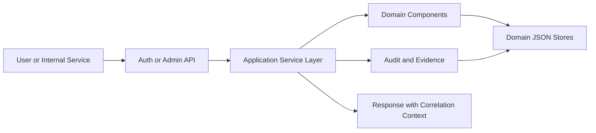

# Component Dependencies

## Dependency Matrix
| From | To | Type | Purpose |
|---|---|---|---|
| Auth API | Authentication Service | Direct call | Login and token validation orchestration |
| Admin API | Authorization Service | Direct call | Admin command authorization and execution |
| Admin API | Privileged Change Governance Service | Direct call | Governed high-impact mutations |
| Authentication Service | Auth Domain | Direct call | Credential and token logic |
| Authentication Service | Audit and Evidence | Direct call | Synchronous critical event recording |
| Authorization Service | Authorization Domain | Direct call | Permission resolution and decisions |
| Privileged Change Governance Service | Approval Workflow | Direct call | SoD approval-state management |
| Privileged Change Governance Service | Audit and Evidence | Direct call | Approval and mutation evidence |
| Privacy Governance Service | Privacy Governance Component | Direct call | Data-subject operations |
| Privacy Governance Service | Audit and Evidence | Direct call | Governance evidence |
| Incident and Continuity Service | Incident and Continuity Component | Direct call | Incident/continuity records |
| All Domain Services | Persistence Gateways | Direct call | Domain storage access per store |
| All Services | Policy and Configuration Service | Direct call | Runtime policy retrieval |

## Communication Pattern Summary
- **Synchronous request path** is used for:
  - authentication and token validation,
  - authorization decisions,
  - critical security and audit event capture.
- **Internal orchestration** is service-to-component direct calls within a modular monolith.
- **No distributed inter-service network hops** in first implementation (single deployable).

## Service/Store Boundary Mapping
- `AuthStore` ↔ Auth Domain Component
- `AuthzStore` ↔ Authorization Domain + Approval Workflow Components
- `AuditStore` ↔ Audit and Evidence Component
- `GovernanceStore` ↔ Privacy Governance + Incident and Continuity Components

## Data Flow Overview

### Text Alternative
- Requests enter Auth/Admin API endpoints.
- API routes to application services.
- Services invoke domain components and persistence gateways.
- Critical operations synchronously emit audit/evidence records.
- Responses include trace/correlation context.
