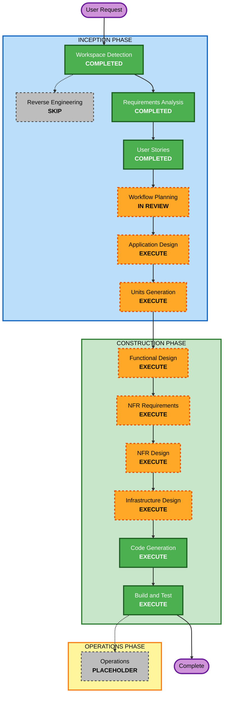

# Execution Plan

## Detailed Analysis Summary

### Transformation Scope
- **Project Context**: Greenfield backend authentication module for a reinsurance subledger system.
- **Transformation Type**: New service implementation with security/compliance-first architecture.
- **Primary Changes**: New authentication/authorization domain, admin management API surface, audit/compliance evidence capabilities, privacy-governance support, and resiliency-aligned operational behavior.
- **Related Components**: Core service API, domain model, JSON persistence layer, security controls, deployment/runtime configuration, CI/CD and governance documentation.

### Change Impact Assessment
- **User-facing changes**: **Yes** (indirect backend-facing impact). Authentication outcomes, access-control behavior, and admin governance flows directly affect human and service consumers.
- **Structural changes**: **Yes**. New service boundaries and core security architecture must be defined.
- **Data model changes**: **Yes**. User, role, permission, audit, incident, and governance metadata entities are required.
- **API changes**: **Yes**. New authentication and administrative endpoints are required.
- **NFR impact**: **Yes**. Security, resiliency, observability, privacy, and compliance constraints are central requirements.

### Risk Assessment
- **Risk Level**: **High**
- **Rollback Complexity**: **Moderate** (greenfield rollout with strong governance controls and blue-green strategy)
- **Testing Complexity**: **Complex** (security, continuity, audit/compliance evidence, and property-based quality constraints)
- **Key Risks**:
  - security-control gaps in initial implementation,
  - compliance evidence traceability drift,
  - resilience process constraints not carried into downstream design/code stages.

## Workflow Visualization

### Text Alternative
- INCEPTION: Workspace Detection (completed), Reverse Engineering (skipped, greenfield), Requirements Analysis (completed), User Stories (completed), Workflow Planning (in review), Application Design (execute), Units Generation (execute).
- CONSTRUCTION: Functional Design (execute), NFR Requirements (execute), NFR Design (execute), Infrastructure Design (execute), Code Generation (execute, always), Build and Test (execute, always).
- OPERATIONS: Placeholder (no active execution in current workflow).

## Phases to Execute

### 🔵 INCEPTION PHASE
- [x] Workspace Detection (COMPLETED)
- [x] Reverse Engineering (SKIPPED - Greenfield project)
- [x] Requirements Analysis (COMPLETED)
- [x] User Stories (COMPLETED)
- [x] Workflow Planning (IN PROGRESS / REVIEW)
- [ ] Application Design - **EXECUTE**
  - **Rationale**: New components, service boundaries, and domain behaviors require explicit design definitions.
- [ ] Units Generation - **EXECUTE**
  - **Rationale**: Scope spans multiple coherent capability groups that should be decomposed into implementation units.

### 🟢 CONSTRUCTION PHASE
- [ ] Functional Design - **EXECUTE**
  - **Rationale**: Security-sensitive business rules and domain invariants require detailed per-unit logic design.
- [ ] NFR Requirements - **EXECUTE**
  - **Rationale**: Strong security/resiliency/compliance requirements must be explicitly translated into per-unit NFR decisions.
- [ ] NFR Design - **EXECUTE**
  - **Rationale**: NFR patterns must be concretely incorporated into design before code generation.
- [ ] Infrastructure Design - **EXECUTE**
  - **Rationale**: Docker runtime, secret handling, observability, backup/recovery, and deployment controls require explicit infrastructure mapping.
- [ ] Code Generation - **EXECUTE** (ALWAYS)
  - **Rationale**: Required implementation stage.
- [ ] Build and Test - **EXECUTE** (ALWAYS)
  - **Rationale**: Required verification stage.

### 🟡 OPERATIONS PHASE
- [ ] Operations - **PLACEHOLDER**
  - **Rationale**: Future stage by framework definition.

## Estimated Timeline
- **Total active stages remaining before coding completion gates**: 8
- **Estimated duration**: Medium-to-high effort due to compliance-heavy design and NFR rigor.

## Success Criteria
- Workflow-approved stage path with clear execute/skip rationale.
- Explicit propagation of security, resiliency, and compliance constraints into downstream design stages.
- Unit decomposition ready for controlled code generation and test planning.
